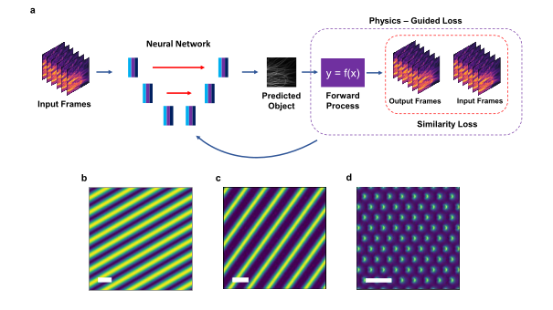

# Untrained-PINN-for-SIM

## Paper
**[Untrained, Physics-Informed Neural Networks for Structured Illumination Microscopy](https://opg.optica.org/oe/fulltext.cfm?uri=oe-31-5-8714&id=526758)**

*Zachary Burns<sup>1</sup> , Zhaowei Liu<sup>1,2,3</sup>*

<sup>1</sup>Department of Electrical and Computer Engineering, University of California, San Diego\
<sup>2</sup>Material Science and Engineering Program, University of California, San Diego\
<sup>3</sup>Center for Memory and Recording Research, University of California, San Diego

## How it works


We demonstrate that a neural network can be used to produce super-resolution images from a single set of raw structured illumination images. The main concept in shown in the above figure. The raw modulated intensity images are fed into a neural network (U-Net), which then produces a predicted output image. The output images is sent through the physical forward model for SIM, assuming full knowledge of the illumination patterns, and is compared to the input images. The loss between the modulated images is then used to update the weights of the network and improve the predicted super-resolution image. In this way, the network can be run in an unsupervised manner, and does not require the collection of a training set.

## Relevant background
  - [Structured illumination microscopy](https://opg.optica.org/aop/fulltext.cfm?uri=aop-7-2-241&id=319011)
  - [Deep image prior](https://openaccess.thecvf.com/content_cvpr_2018/html/Ulyanov_Deep_Image_Prior_CVPR_2018_paper.html)
  - [Untrained neural networks](https://www.nature.com/articles/s41377-020-0302-3)

## Citation
If you use this work for your research please cite:
```
@article{burns2023untrained,
  title={Untrained, physics-informed neural networks for structured illumination microscopy},
  author={Burns, Zachary and Liu, Zhaowei},
  journal={Optics Express},
  volume={31},
  number={5},
  pages={8714--8724},
  year={2023},
  publisher={Optica Publishing Group}
}
```
